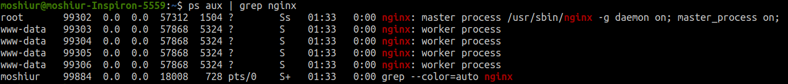

### nginx installation
```
sudo apt-get update
sudo apt-get install nginx
```
* At this point, nginx is not only installed,but also running. To ensure this, run
```
ps aux | grep nginx
```
* Output will be somethig like below


* We can also test on browser. Run 

```
ifconfig
```
* Copy the ip address (inet) and hit on browser. Nginx homepage should be appeared.
* Check the configuration files located at /etc/nginx folder. Run
```
ls -l /etc/nginx/
```
### Building nginx from source and adding modules
* Download the mainline version of nginx from http://nginx.org/en/download.html . Copy the link of .pgp(not the windows version)
* Extract the tar.gz file
```
tar -xzvf nginx-1.19.0.tar.gz
```
* Go to the extracted directory
```
cd nginx-1.19.0/
```
* First step is to configure our source code for the build. To do this, run the configure script inside the source code directory.
```
./configure
```
* If **C Compiler cc not found** appeares, run 
```
sudo apt-get install build-essential
```
* Now, we've all necessary tools to compile nginx. Re run the ./configure command, Compiler not found error should be gone.
* Now, we'll have to install some packages to remove PCRE library errors which is appeared at the bottom.
```
sudo apt-get install libpcre3 libpcre3-dev zlib1g zlib1g-dev libssl-dev 
```
* Now, it's time to add some customized configuration flags. 
```
./configure --sbin-path=/usr/bin/nginx --conf-path=/etc/nginx/nginx.conf --error-log-path=/var/log/nginx/error.log --http-log-path=/var/log/nginx/access.log --with-pcre --pid-path=/var/run/nginx.pid --with-http_ssl_module
```
* Compile the configuration source by running 
```
make
```
* Now, install the compiled source by running
```
sudo make install
```
* Nginx is now installed with our customized configuration. Check the version of nginx by
```
nginx -V
```

### Creating a sample virtual host
* We'll create a basic virtual host that serves static files. 
* Create a directory in Desktop and place a html file,a css file linked with that html and a image.
```
cd Desktop/moshiur/nginx
touch index.html style.css sample.png
```
* We've to edit the main configuration file which is at /etc/nginx/ path.
```
sudo gedit /etc/nginx/nginx.conf
```
* Replace everything with the following lines inside it
```
events{}

http{
	server{
		listen 80;
		server_name localhost;
		root /home/moshiur/Desktop/nginx;
	}
}
```
* Always check the conf file if there is any error or not.
```
sudo nginx -t -c /etc/nginx/nginx.conf
```
* If there is no error in the conf file, reload nginx. We've to do this everytime we make any change inside the nginx.conf file.
```
sudo systemctl reload nginx
```
* Now, if we hit "localhost" on our browser, our html page should be appeared instead of the nginx homepage. Because, we've replaced everything inside the nginx.conf file. 
* We'll notice that, html file is appeared but css is not loaded. Its because, the css file is not treated according to its corresponsding Content-Type. To ensure this, run
```
curl -I http://localhost/style.css
```
We'll notice that, Content-Type of style.css is **text/plain**. 
To enable all the mime types, We'll have to include **mime.types** inside nginx.conf file. So, our nginx.conf file should be like following:
```
events{}

http{
  include mime.types;
	server{
		listen 80;
		server_name localhost;
		root /home/moshiur/Desktop/nginx;
	}
}
```
* If we run the command again
```
curl -I http://localhost/style.css
```
We'll notice that, Content-Type is not text/css. Hit the browser again and html page will be loaded with css.

## location blocks

#### Preference order: 
**1. Exact Match: = URI**
* Will execute this block that exactly match with this URI. 
* http://localhost/greet 

```
location = /greet{
			return 200 "Hello Moshiur - From exact location";
		}
```
**2. Preferential Prefix Match ^~ URI**
* Same as prefix match but has higher priority than regex match
* http://localhost/greet2
```
# Preferential Prefix match
		location ^~ /greet2{
			return 200 "Hello Moshiur- From Preferential prefix location";
		}
```
**3. REGEX match ~* URI**
* Has higher priority than prefix match. but less priority than preferential prefix match.
* http://localhost/greet2
```
# Regex match Case insensitive
		location ~* /greet[0-9]{
			return 200 "Hello Moshiur- From prefix-case insensitive location";
		}
```
**4. Prefix match URI**
* Lowest priority. Will execute this block when anything starts with greet
* http://localhost/greeting , http://localhost/greetmoshiur etc.
```
# Prefix match
		location /greet{ 
			return 200 "Hello Moshiur- From prefix location";
		}
```
* Location context should be placed inside server context.
* nginx.conf file

```
events{}

http{
	
	include mime.types;

	server{
	
		listen 80;
		server_name localhost;
		root /home/moshiur/Desktop/nginx;

		# Prefix match
		location /greet{ 
			return 200 "Hello Moshiur- From prefix location";
		}

		# Exact match
		location = /greet{
			return 200 "Hello Moshiur - From exact location";
		}

		# Regex  match Case sensitive
		location ~ /greet[0-9]{
			return 200 "Hello Moshiur - From regex-case sensitive location";
		}

		# Regex match Case insensitive
		location ~* /greet[0-9]{
			return 200 "Hello Moshiur- From prefix-case insensitive location";
		}

		# Preferential Prefix match
		location ^~ /greet2{
			return 200 "Hello Moshiur- From Preferential prefix location";
		}
	}
}

```

## nginx variables
* 2 types of variables
  -  **Configuration Variables:** set $var 'some';
  -  **Nginx Module Variables:** $http,$uri,$args etc
  ### Configuration Variables:
  * We can use **if** condition inside nginx.conf file. Suppose, we'll have to determine is today weekend or not. We'll browse http://localhost/isWeekend and browser will return true or false based on the current day. If its saturday or sunday, it'll return true as its weekend. Otherwise false.
  * Edit nginx.conf file:
  ```
  events{}

  http{
	
	include mime.types;

	server{
	
		listen 80;
		server_name localhost;
		root /home/moshiur/Desktop/nginx;

		set $weekend 'fasle';

		if  ($date_local ~* 'saturday|sunday'){
			set $weekend 'true';
		}

		location /isWeekend{
			return 200 $weekend;
		}
	}
  ```
  * **There's a space between if and the paranthesis. Its mandatory**. 
  * $date_local is a nginx variable which represents the current date.Here, we've used regular expression **~** to match saturday or sunday. * represents case insensitive.
  * On the browser, hit http://localhost/isWeekend , it'll show true/false 
  
  ### Nginx Module Variables:
* uri,host name and query parameters can be extracted using the module variables. 
* Edit the nginx.conf file
```
location /inspect{
	return 200 "$host\n$uri\n$args\n$arg_name";
	}
```
* Hit the browser http://localhost/inspect?name=shuvo. Here, $host=localhost,$uri=/inspect,$args=query parameters,$arg_name is a compiled variable by nginx based on the query params. If there was another query param address=dhaka, then it could be extracted using $arg_address. For example,if our url is http://localhost/inspect?name=shuvo&address=dhaka&age=20 we can extract the individual query parameters like the following: 
```
location /inspect{
		return 200 "host:$host\nuri:$uri\nname:$arg_name\naddress:$arg_address\nage:$arg_age";
		}
```

* output: 
```
host:localhost
uri:/inspect
name:shuvo
address:dhaka
age:20
```

## rewrite vs redirect
### redirect: 
* status code 300 series and response data(strng) is a uri. Lets say, We get an image by hitting localhost/thumb.png. Now, we want to get this by hitting localhost/logo. We can simply redirect the url like the following. In this case, uri on browser will be changed after redirecting.  url will be location/logo to location/thumb.png as url is being redirected
```
location /logo{
    return 307 /thumb.png ; 
    }
```
### rewrite:
* In this case, url is not changed. url is reevaluated. 
```
rewrite ^/user/\w+ /greet
location /greet{
	return 200 "hello user" ; 
	}
```
* Here, if we hit localhost/user/shuvo, it'll reevaluated to /greet internally and nginx will search for this /greet location from the beginning of the conf file. That's why, we need to declare a location /greet. In this case, url is not changed on browser. We hit localhost/user/shuvo , we'll get result which is returned by /greet (hello user) but url will remain same(localhost/user/shuvo)
* We can capture certain part of uri in rewrite. From ^/user/(\w+) we can capture the name part i.e. (w\+) by $1, $2 ...
```
rewrite ^/user/(\w+) /greet/$1
location = /greet/shuvo{
	return 200 "hello shuvo" ; 
	}
```
* Here, if we hit localhost/user/shuvo, it'll reevaluated to /greet/shuvo, and after geeting the exact match with the location, it'll return "hello shuvo".
* In the following scenario, if we hit, localhost/user/shuvo, It'll be re-written to /localhost/greet/shuvo. Then starting form the beginning, it'll match ^/greet/shuvo and again will be re-written to /thumb.png. Finally, thumb.png will be served but url will be still localhost/user/shuvo. 
```
rewrite ^/user/(\w+) /greet/$1 ; 
rewrite ^/greet/shuvo /thumb.png
```
* Rewriting uri can be restricted using a flag named "last". By declaring like "rewrite ^/user/(\w+) /greet/$1 last" , we're telling nginx that, skip the rest of the rewrite directives. Its the last time. no need to rewrite anymore. 
```
events{}

http{
	
	include mime.types;

	server{
	
		listen 80;
		server_name localhost;
		root /home/moshiur/Desktop/nginx;

		set $weekend 'fasle';


		if  ($date_local ~* 'saturday|sunday'){
			set $weekend 'true';
		}

		rewrite ^/user/\w+ /greet ; 
		rewrite /greet /logo ; 
		rewrite /logo /homepage ; 
		rewrite /homepage /moshiur ;
		rewrite =/moshiur /dsi ; 

		rewrite ^/profile/(\w+)/(official)/(mail) /hello/$1/$2/$3 ; 

		location /shuvo {
			return 307 /index.html ; 
		}
		location = /homepage{
			return 200 "location : homepage" ; 
		}

		location /moshiur{
			return 200 "location: moshiur";
		}

		location /dsi{
			return 200 "Dynamic Solution Innovators Limited";
		}

		location = /greet{
			return 200 "hello user. re-evaluated from user/word";
		}
		
		location /logo{
			return 307 /thumb.png;
		}

		location /isWeekend{
			return 200 $weekend;
		}

		 location /inspect{
			return 200 "host:$host\nuri:$uri\nname:$arg_name\naddress:$arg_address\nage:$arg_age";
		}

		location = /hello/shuvo/official/mail{
			return 200 "hello shuvo-official-mail..regular expression captcha group" ; 
		}
	}
}
  
```

### try_files
```
root /home/shuvo ; 
try_files $uri /cat.png /greet /notfound ; 
location /greet {
	return 200 "hello" ; 
	}
location /notfound{
	return 404 "not found" ; 
	}
```
* try_files checks for the resources regardless the uri. whatever we hit on browser, such as localhost/abcd, It'll execute like the following: 
  * /home/shuvo/cat.png ; cat.png is not present in /home/shuvo, so forward to the next resource
  * /home/shuvo/greet   ; we have a location named /greet but not in the root location. so, forward..
  * /home/shuvo/notfound; only the last location is rewriteen and executed. /notfound location will be executed. 
### error_log access_log
```
location /secure{
			# creats a log file names secure.access.log inside /var/log/nginx directive. 
			# Hitting localhost/secure on browser,logs will be available inside this file.
			access_log /var/log/nginx/secure.access.log ; 

			# We can simply skip logging for this location
			access_log off ; 
			return 200 "secured area... secure location"  ; 
		}
```
## Inheritence & Directive Types
-  3 types of directives.
   - Standard Directive
   - Array Directive
   - Action Directive
   
___

### HTTP 2
* HTTP2 features:
  -  Binary Protocol: HTTP 1.1 is a textual protocol, while HTTP2 is a binary protocol. HTTP 2 transfers  binary data consists   of only 0 and 1
  - Compressed Header
  - Persistent Connection
  - Multiplex Streaming
  - Server Push
  
  ### Enabling HTTP2
  
  * create a sefl signed certificate and key
  ```
  sudo mkdir /etc/nginx/ssl
  openssl req -x509 -days 10 -nodes -newkey rsa:2048 -keyout /etc/nginx/ssl/self.key -out /etc/nginx/ssl/self.crt
  ```
  * nginx.conf
  ```
  server{
  listen 443 ssl http2;
		

	    ssl_certificate /etc/nginx/ssl/self.crt ; 
	    ssl_certificate_key /etc/nginx/ssl/self.key ; 
		}
  ```
 ### Redirecting HTTP to HTTPS
 ```
 http{
 	server{
		listen 80 ; 
		server_name localhost ; 
		return 301 https://$host$request_uri ; 
	}
 }
 ```
 
 ### Optimizing SSL
 * Generate dh parameters
 ```
 openssl dhparam -out /etc/nginx/ssl/dhparam.pem 2048
 ```
 * nginx.conf
 ```
 server{
	
		listen 443 ssl http2;
		server_name localhost;
		root /home/moshiur/Desktop/nginx;

		ssl_certificate /etc/nginx/ssl/self.crt ; 
	    ssl_certificate_key /etc/nginx/ssl/self.key ; 

	    # Disable SSL
	    # Enable TLS
	    # SSL was replaced by TLS(Transport Layer Security)
	    # Our http connection is being encrypted by TLS, not SSL
	    ssl_protocols TLSv1 TLSv1.1 TLSv1.2 ; 

	    # Specify which cipher suits should our TLS protocol use to
	    # encrypt out http connection
	    ssl_prefer_server_ciphers on ; 
	    ssl_ciphers ECDH+AESGCM:ECDH+AES256:ECDH+AES128:DH+3DES:!ADH:!AECDH:!MD5;

	    # Enabling DH params(Diffie-Hellman) Key exchange
	    # Allows performing key exchange between client and server with pure secrecy
	    ssl_dhparam /etc/nginx/ssl/dhparam.pem;

	    # Enabling HSTS
	    add_header Strict-Transport-Security "max-age=31536000" always;

	    # SSL sessions
	    ssl_session_cache shared:SSL:40m;
	    ssl_session_timeout 4h ; 
	    ssl_session_tickets on ; 
	}
 ```
 
### Rate Limiting 
* Manage incoming connection to the server for specific reason. Specific reasons can be one of the following:
- Security: Burte-force protection
- Reliablility: Prevent traffic spikes
- Shaping: Service priority
- Install Siege
```
sudo apt-get install siege
```
